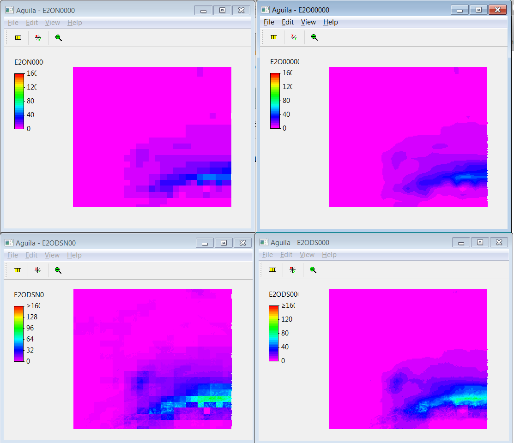
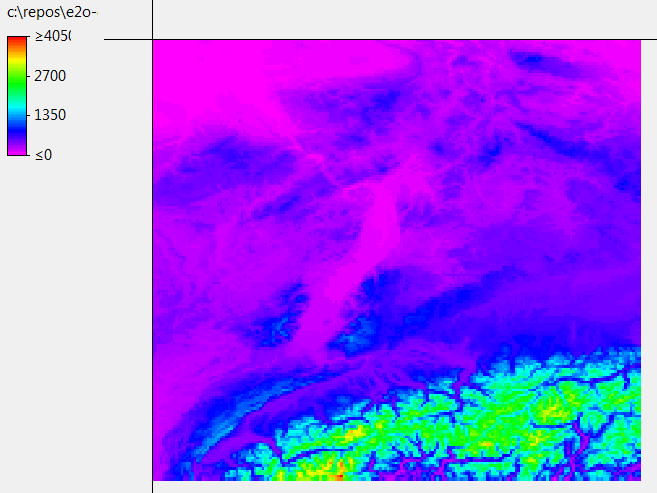
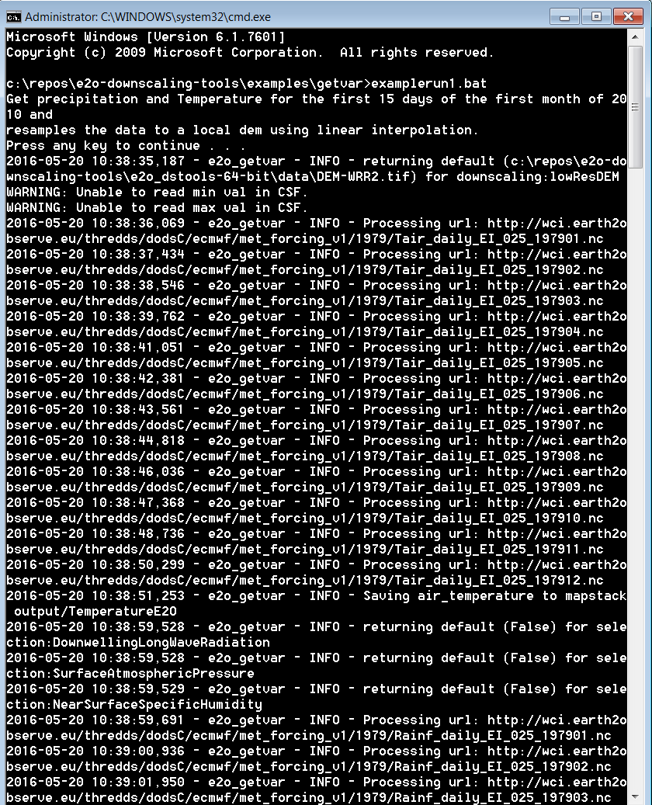
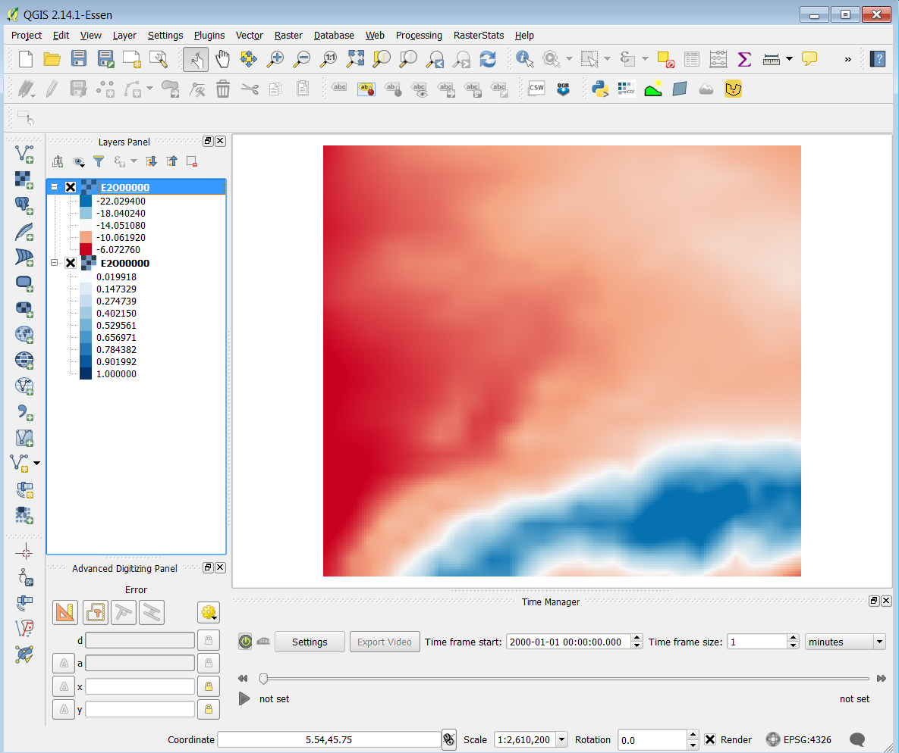

Introduction
============

e2o_downscaling tools consists of a number of Python based meteorological scripts focussing on downscaling the
meteorological forcing of the eartH2Observe project. The scripts can:

+ retrieve all meteorological variables that are part of the eartH2Observe WRR1 and WRR2 datasets
for a region of interest on a user defined grid extent and resolution;
+ downscale the meteorological variables temperature and air pressure using a DEM based elevation correction;
+ calculate potential evaporation from the WRR1 and WRR2 datasets using the Penman-Moneith, Priestley-Taylor
or Hargreaves equation, optionally considering elevation corrections for temperature, air pressure and
radiation and shading corrections for radiation.

The current functionality is implemented in three scripts that all output daily values:

+ e2o_radiation.py - Make clear sky radiation maps and inclination correction maks for optional use by the
  e2o_calculateEvaporation.py script
+ e2o_getvar.py - Download and resample variables from the meteorological forcing datasets (V1 and V2). This script
  resamples and extracts the data there is no further downscaling applied.
+ e2o_calculateEvaporation.py - Calculate reference evaporation from the meteorological forcing dataset
 (three available methods) using elevation based downscaling optionally combined with radiation dowsscaling using the output
 of the e2o_radiation script. The script can also output downscaled versions of all variables used to calculate the evaporation.

The only input the user needs to supply is a high-resolution regular DEM in GEOTiff format of the area he/she is
interested in. Reference evaporation will be calculated from the eartH2Observe dataset which is based on the WFDEI
dataset that is corrected following the method developed in the EU FP6 project WATCH. In this method ERA-interim
re-analysis data is corrected with the observation based CRU dataset (Weedon et al., 2014). The dataset covers the
period 1979-2012 and contains the following 3-hourly gridded data fields: Air temperature, rainfall rate, air
pressure at surface, longwave downward radiation, shortwave downward radiation, air humidity and wind speed. Daily
values are derived by calculating the daily average of the 3-hourly values.

Determining downscaled reference evapotranspiration from the forcing dataset
============================================================================

The tools assume you have a digital elevation model for your area. This file should be in
a GDAL supported format (preferably GTiff).

+ Optionally, first run the e2o_radiation script. This will generate Clear-Sky radiation maps for each day of the
  year (four maps per day). These maps can be used by the e2o_calculateEvaporation script to downscale
  reference ET
+ Next run the e2o_calculateEvaporation script. This will calculate downscaled ET based on a local DEM for
  the period you specify in the .ini file

.. note::
    See the documentation per module for more information.

The figure below shows the steps used to generate down-scaled reference evaporation in the scripts.

.. digraph:: steps

    "Clear sky radiation maps" [shape=box];
    "Reference evaporation" [shape=box];
    "e2o_radiation.py" -> "Clear sky radiation maps" [label =" Correct for aspect and slope with DEM"];
     "e2o_calculateEvaporation.py" -> "Reference evaporation" [label =" Downscale using DEM and clear-sky maps"]
    "Clear sky radiation maps" -> "e2o_calculateEvaporation.py"

    dpi=69;

This document is merely a technical user manual. For background reading on the scientific concepts used we
will in the text refer to the online documentation.

Region specific user-defined settings
-------------------------------------

In this section we discuss all options that are user adjustable and can be specified for the region, resolution and
period of interest. Options will be discussed following the order in the .ini file.

User specified DEM of area of interest
~~~~~~~~~~~~~~~~~~~~~~~~~~~~~~~~~~~~~~

The user can specify his region of interest, and the desired regular grid resolution by providing a high resolution
DEM covering the region of interest. The file should be provided in a GDAL supported rater format. The location
and name of the file are given in the ini file:

::

    [downscaling]
    highResDEM=highResDEM\wflow_dem.map
    radiationcordir=output_rad\
    #radiationcordir=None

The DEM will be used for the definition of the extend and resolution of the generated meteorological output files. If
the option ‘downscaling’ is turned on the altitudes in the DEM will be used to spatially
downscale temperature, air pressure and radiation. IF the directory containing the radiation data is set to 'None' the radiation
is not corrected according to aspect and slope but only for altitude.

User settings in the e2o_calculateEvaporation.ini file
~~~~~~~~~~~~~~~~~~~~~~~~~~~~~~~~~~~~~~~~~~~~~~~~~~~~~~

Below a description of  the content of the .ini file is given. Options can be turned on or off by:

+ for multiple options: 	adding / deleting a hashtag in front fo the option
+ for simple on or off: 	indication True (on) or False (off)

*Server location*

The server location refers to the online location where the eartH2Observe WRR datasets are hosted. At this stage
there are two datasets available:

+ the WRR1 dataset which is directly derived from the global WATCH-Forcing-Data-ERA-Interim dataset (Weedon et al.,
2014) that was developed as processor of the WATCH forcing dataset developed in the EU FP6 project EU-WATCH (Weedon
et al., 2012). This dataset has a spatial resolution of 0.5 degrees and a 3-hourly temporal resolution.
+ the WRR2 dataset in which several improvements have been made compared to the WRR1 dataset.
 This dataset has a spatial resolution of 0.25 degrees and a 3-hourly temporal resolution.

The serverroot for both datasets is:

serverroot = http://wci.earth2observe.eu/thredds/dodsC/

The wrrsetroot depends on the dataset a user prefers to use:

+ For the WRR1 : 	wrrsetroot = ecmwf/met_forcing_v0/

+ For the WRR2 : 	wrrsetroot = ecmwf/met_forcing_v1/

.. note::

    At this stage the WRR2 dataset is largely untested.

Evaporation options
~~~~~~~~~~~~~~~~~~~

Three methods to calculate evaporation have been implemented in the down-scaling tool:

+ Penman-Monteith : a physically based equation considering most relevant atmospheric processes

+ Priestley-Taylor : a substitute of the Penman-Monteith equation where the aerodynamic term has been replaced by an
empirical multiplier

+ Hargreaves : A simplified form of the Penman-Monteith equation using temperature and an annual radiation cycle as input

For more information on the implemented equations and a brief comparison we refer to Sperna Weiland et al. (2015).

The equation to be used can simply be selected by removing the hashtag in front of the specific method making sure
the hashtag is present before all other methods. In the example below Penman-Monteith will be used.

::

    # Choose one of the three methods below
    evapMethod = PenmanMonteith
    #evapMethod = Hargreaves
    #evapMethod = PriestleyTaylor

*Resampling and downscaling*

With the option resampling the user can select whether the data needs to be resampled to the resolution of the by the
 user provided DEM (see section 3.1).

If the option resampling is set to True a second optimization can be chosen with the downscaling option. If the
downscaling option is set to True temperature and air pressure will be corrected based on the difference in
altitude in the high-resolution user specified DEM and the low-resolution DEM that belongs to the WRR1 or WRR2
datasets.

These DEMs are located in the folder : /e2o_downscaling/e2o_dstools/data and are called DEM-WRR1.tif and
DEM-WRR2.tif. The downscaling tool automatically selects the correct DEM based on the selected meteorological forcing
(met_forcing_v0 or met_forcing_v1) defined in the .ini file at wrrsetroot. When both downscaling and resampling are
set to false the maximum spatial extend required for the data to be read from the netCDFs file can be set by
defining the corners of the area of interest: latmin, latmax, lonmin and lonmax.

If one is for example only interested in data for Australia the process can be accelerated by avoiding the reading of
the full world maps from the netCDFs file by setting an extend slightly larger than the Australian continent.

::

    # Specify bounding box to download from server. Should be a bit bigger that the DEM
    latmin = -45
    latmax = -4
    lonmin = 110
    lonmax = 155

*Variable lapse rate*

For the downscaling of temperature, air pressure and radiation from the WRR1 dataset only a constant lapse rate of -0
.006 degrees/m can be used. The WRR2 datasets contains monthly fields of spatially and temporal varying lapse rates
 – derived from atmospheric conditions. To use these varying lapse rate fields for the downscaling the following
 option should be set to True:

::

    [downscaling]
    # useVarLapseRate = True -> use spatial and temporal varying lapse rate provided as part of the WRR2 forcing dataset
    # in stead of the default value of -0.006
    useVarLapseRate = True

*Time period*

The WRR1 and WRR2 datasets are available for the period 01-01-1979 to 31-12-2012. The user can specify the period of
interest, see the example below for 1979:

::

    # Start and end-year, month and day of the evaporation calculations
    startyear = 1979
    endyear= 1979
    startmonth = 1
    endmonth = 12
    startday = 1
    endday = 31

Radiation correction
--------------------

The WRR1 and WRR2 provide potential solar radiation which is the radiation of an unobstructed or cloudless sky. The
magnitude of this potential solar radiation that reaches the earth surface depends on the position of the sun the
solar altitude or solar angle during the day, the inclination of the solar rays with the earth’s surface, the amount
of radiation at the outer layer of the earth’s atmosphere, the transmissivity of the sky and the altitude of the
earth’s surface.

With the high resolution DEM the potential solar radiation can be corrected for aspect and shading. The correction
for cloudiness and other back scatter is derived from the transmissivity of the air and the path length radiation
needs to travel before reaching the earth’s surface.

The coefficient for radiation correction are calculated in the radiation sub-routine are describe seperately.
The directory where the correction files are located should be defined in the ini file:

::

    [downscaling]
    # Where to find the output of the e2o_radiation script
    radcordir=output_rad

Below you will find the filenames and their content:

::

    COR00000.??? - Total clear sky radiation on DEM
    SUN00000.??? - Nr of time intervals a pixel was in the sun
    FLAT0000.??? - Total clear sky radiation on a flat surface
    CORDIR00.??? - Direct clear sky radiation on DEM
    FLATDIR0.??? - Direct clear sky radiation on a flat surface

For full details see the radiation section.

*Output*

The user can specify the format of the output files – any of the gdal formats can be selected. These can, together
with their shortnames, be found at:
http://www.gdal.org/formats_list.html

::

    [output]
    # Gdal output format string
    # See: http://www.gdal.org/formats_list.html
    # examples: AAIGrid, PCRaster, GTiff etc
    format=	GTiff

The user can indicate the output location where all files should be stored:

::

    directory=output/

The first letters of the evaporation output files are set with the prefix:

::

    prefix=PET

If all other meteorological variables need to be saved the “saveall” option should be set to true.

::

    # If saveall is true all variables used are saved instead of only the PET
    saveall=1

Example e2o_calculateEvaporation ini file:

::
 
    [url]
    # Server location and location of the WRR forcing
    serverroot = http://wci.earth2observe.eu/thredds/dodsC/
    wrrsetroot = ecmwf/met_forcing_v1/

    [selection]
    # What to do
    calculateEvap = True
    # Choose one of the three methods below
    evapMethod = PenmanMonteith
    #evapMethod = Hargreaves
    #evapMethod = PriestleyTaylor

    # Specify box to download from server. Should be a bit bigger that the DEM
    latmin = -90
    latmax = +90
    lonmin = -180
    lonmax = 180

    # Start and end-year, month and day of the evaporation calculations
    startyear = 1979
    endyear= 1979
    startmonth = 1
    endmonth = 12
    startday = 1
    endday = 31

    [downscaling]
    # location of original DEM (WFDEI) and the local high resolution DEM
    highResDEM=highresdem\DEM.tif
    # Resampling = True -> resample to resolution of dEM specified in downscaling section
    # Downscaling = True -> also apply DEM based correctiosn of T, Radiation, Pressure
    resampling  = True
    downscaling = True
    # useVarLapseRate = True -> use spatial and temporal varying lapse rate provided as part of the WRR2
    # forcing dataset in stead of the default value of -0.006
    useVarLapseRate = True
    # Where to find the output of the e2o_radiation script
    radcordir=output_rad

    [output]
    # Gdal output format string
    # See: http://www.gdal.org/formats_list.html
    # examples: AAIGrid, PCRaster, GTiff etc
    format=	GTiff
    directory=output/
    prefix=PET
    # Is saveall is true all variables used are saved instead of only the PET
    saveall=1

Downscaling Precipitation
-------------------------

The e2o_getvar script can downscale precipitation (Rainfall) using the WorldClim dataset which supplies monthly
climatology. It does so using the following
steps:

+ The WorldClim data is averaged to the resolution of the original data (0.25 degree)
+ For each timesteps a factor is determined for each pixel by dividing the WordClim data for the corresponding month
  by the current data.
+ This factor is rescaled to the desired output resolution
+ The WorldClim data at the desired output resolution is divided by the derived factor to obtain downscaled input data

If we assume the input precipitation data is the avegare for the 0.25 grid cell it is best to use the nearest interpolation.
The efects of downscaling and interpoltion types is shown in the figure below.

    Precipitation for the earth2observe MSWEP dataset for the Rhine basin. Top left is the original
    data interpolated using a nearest interpolation. Top right the original data but interpolated
    linear. Bottom left is downscaled using the WorldClim data using a nearest interpolation while
    the bottom right is downscaled using WorldClim and a linear interpolation.

Running the examples
====================

The example directory currently has two examples:

+ getvar - example for the e2o_getvar scripts
+ evaporation - example fro the e2o_calculateEvaporation script

getvar
------

The getvar directory contains the following files:

+ run_example.bat - windows batch file to run one of the examples
+ e2o_getvar.ini - configuration file for e2o_getvar to download and downscale Temperature
+ examplerun1.ini - configuration file for e2o_getvar to download and interpolate MSWEP Precipitation
+ examplerun2.ini - configuration file for e2o_getvar to download and Downscale MSWEP Precipitation. You will
need to have downloaded and processed WorldClim precipitation data to use this example.
+ README.txt - Some information on the example
+ wflow_dem.map - local scale digital elevation model

    The local elevation model (wflow_dem.map) used for downscaling.

The contents of the e2o_getvar.ini file is shown below. This contains all the settings for the e2o_getvar
script. For example, by changing the line "interpolmethod=linear" to "interpolmethod=nearest" the
script will uses a different interpolation method. Here the local elevation model (wflow_dem.map)
is also specified. The map can be in any GDAL supported raster format. The grid should be defined in lat,lon.
Optionally you can save the results in a netCDF4 file by specifying the netcdfout option in the output section.
In that case you can also specify attributes to save in the netcdf file, see example3.ini.

.. literalinclude:: _static/e2o_getvar.ini

As can be seen from the file (the conversions section) two unit conversions have been setup: Temperature is
converted to degree Celsius and rainfall is converted to mm.

To run the example type run_example.bat in a windows command box. You should see output similar to the screenshot below:

    Running the example1.bat file.

The results are stored in the directorie:

+ output\Temperature\

The directory contains one file for each time number 001 to the last step (365):

::

    TEMP0000.001
    TEMP0000.002
    TEMP0000.003
    TEMP0000.004
    ....
    TEMP0000.365

The files can be opened in most GIS programs or in the PCRaster aguila program.

    Display results of one timestep in QGIS.

If you set the output format in the ini file to PCRaster the resulting files can be used directly in
the wflow hydrological models (https://github.com/openstreams/wflow).

